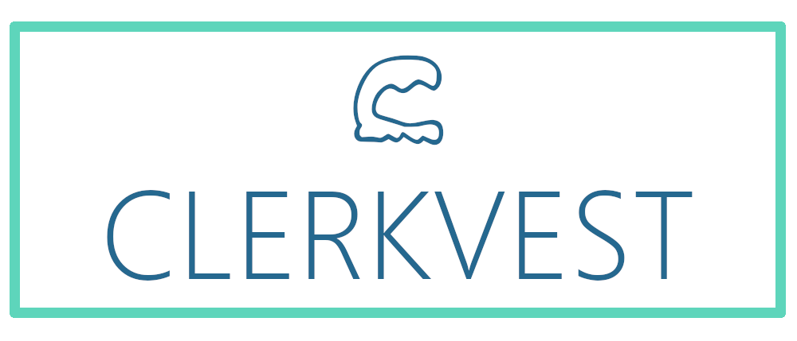

<p align="center">
  <a href="https://github.com/clerkvest">
    
  </a>
  <br>
  <a href="https://github.com/Clerkvest/Clerkvest-API">
    
  </a>     
  <a href="https://www.codacy.com/manual/Qu1oX/Clerkvest-API?utm_source=github.com&amp;utm_medium=referral&amp;utm_content=Clerkvest/Clerkvest-API&amp;utm_campaign=Badge_Grade">
    
  </a>
</p>

### Getting Started [](https://github.com/clerkvest/clerkvest-api) [](https://github.com/clerkvest/clerkvest-api) [](https://github.com/clerkvest/clerkvest-api) [](https://github.com/clerkvest/clerkvest-api)
> These instructions will get you a copy of the project up and running on your local machine for development and testing purposes. See     deployment for notes on how to deploy the project on a live system.

> #### The default Profile is "dev", the Profile requires a Environment Variable named SENDGRID_API_KEY. You can either set this Environment Variable or replace the sendgrid.api.key value inside the application-dev.properties with a String.

- Build the Project: `mvn -B package --file pom.xml -Dmaven.test.skip=true`
- Switch to the target folder: `cd target`
- Run the Jar: `java -jar api-<version>.jar`

### Prerequisites
> Prerequisites to building and running this software

```
Java >= 11
Maven
```

### Deployment

> A step by step series of examples that tell you how to get a live System running

To Deploy the System you will have to configure the Spring Application trough the application.properties. Create a new Application Profile and set the application.properties to the newly created Profile, this will tell Spring Boot to use that Profile.
#### Example  Profile 
```
spring.datasource.url = jdbc:postgresql://localhost:5432/dbname -- Required
spring.datasource.username = dbuser
spring.datasource.password = dbpassword
server.port=8080  
server.servlet.context-path=/api
  
spring.jpa.hibernate.ddl-auto = none  
spring.datasource.data=classpath:data-prod.sql  
spring.datasource.schema=classpath:schema-prod.sql

*sendgrid.api.key = API_KEY -- Required
```

Using the Test Data a call to the GET Project Endpoint results in following Response:
```json
{
    "employeeId": 0,
    "companyId": 0,
    "link": "google.de",
    "title": "Google",
    "description": "Lets buy google",
    "goal": 100000,
    "investedIn": 10,
    "reached": false,
    "createdAt": "2020-02-04T17:38:31.582971",
    "fundedAt": null,
    "id": 0,
    "image": null,
    "_links": {
        "self": {
            "href": "http://localhost:8080/api/project/get/0"
        },
        "all": {
            "href": "http://localhost:8080/api/project/all"
        },
        "delete": {
            "href": "http://localhost:8080/api/project/delete/0"
        },
        "create": {
            "href": "http://localhost:8080/api/project/create"
        },
        "update": {
            "href": "http://localhost:8080/api/project/update"
        }
    }
}
```
## Running the tests
> How to run the automated tests for this system

    mvn test

## Built With

* [Spring Boot](https://docs.spring.io/spring-boot/docs/2.2.4.RELEASE/reference/html/) - The Rest framework used
* [Maven](https://maven.apache.org/) - Dependency Management
* [Sendgrid](https://sendgrid.com/) - Used to Send Login Mails
* [PostgreSQL](https://www.postgresql.org/docs/) - Database


## Authors

* **Michael** - *Initial work* - [Voxen4]([https://github.com/Voxen4](https://github.com/Voxen4))
* **Danny** - *Initial work* - [Qu1oX]([[https://github.com/Qu1oX](https://github.com/Qu1oX)](https://github.com/Qu1oX))

See also the list of [contributors]([https://github.com/Clerkvest/Clerkvest-API/graphs/contributors](https://github.com/Clerkvest/Clerkvest-API/graphs/contributors)) who participated in this project.

## License

This project is licensed under the GPL-3.0 License - see the [LICENSE.md](LICENSE.md) file for details
